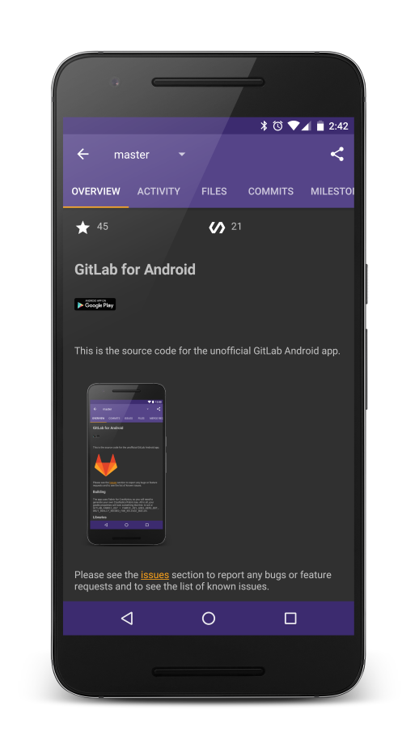

# LabCoat for GitLab

[](https://gitlab.com/Commit451/LabCoat/commits/master) [](https://discord.gg/SDxsaKE)



[](https://play.google.com/store/apps/details?id=com.commit451.gitlab)

## Issues
Please see the [issues](https://gitlab.com/Commit451/LabCoat/issues) section to report any bugs or feature requests and to see the list of known issues.

## Building
You should be able to build the project from Android Studio without any further setup. The app uses Fabric for crash reporting, so if you wanted to do a release build, you would need to generate your own Crashlytics/Fabric key. All in all, your `gradle.properties` will look something like this:
```Gradle
LABCOAT_FABRIC_KEY = FABRIC_KEY_GOES_HERE_BUT_ONLY_REALLY_NEEDED_FOR_RELEASE_BUILDS
```

To build, run the following.

```bash
./gradlew assembleDebug
```

## Contributing
Please fork this repository and contribute back! Please make your best effort to break up commits as much as possible to improve the reviewing process.

If you are making substantial changes, please refer to Commit 451's style [guidelines](https://github.com/Commit451/guidelines) for Android/Kotlin

License
--------

    Copyright 2017 Commit 451

    Licensed under the Apache License, Version 2.0 (the "License");
    you may not use this file except in compliance with the License.
    You may obtain a copy of the License at

       http://www.apache.org/licenses/LICENSE-2.0

    Unless required by applicable law or agreed to in writing, software
    distributed under the License is distributed on an "AS IS" BASIS,
    WITHOUT WARRANTIES OR CONDITIONS OF ANY KIND, either express or implied.
    See the License for the specific language governing permissions and
    limitations under the License.